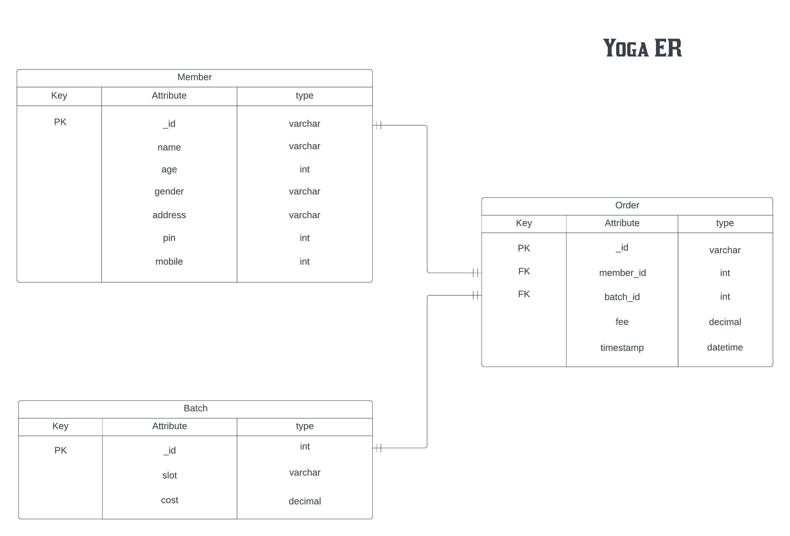
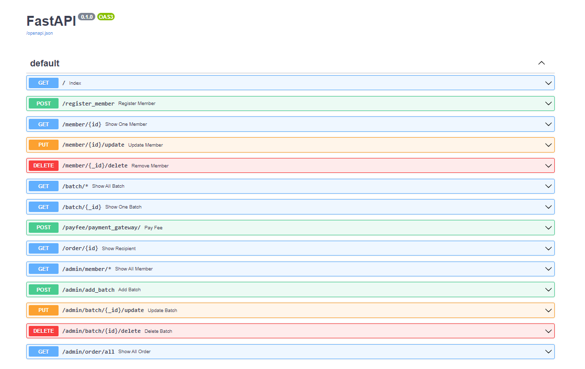

# Yoga Backend

   

## Technology

- FastAPI : API Framework
- MongoDB : Database

## Schema

- ### Member

    - _id     : varchar (Primary Key)
    - name    : varchar 
    - age     : int 
    - gender  : varchar 
    - address : varchar 
    - pin     : int 
    - mobile  : int 

- ### Batch

    - _id  : varchar (Primary Key)
    - slot : varchar
    - cost : decimal 

- ### Order

    - _id       : varchar (Primary Key)
    - member_id : int (Foreign Key)
    - batch_id  : int (Foreign Key)
    - fee       : decimal
    - timestamp : datetime

- ### ER Diagram
    

## Querries

- ### Member
    - getAllMember
    - getOneMember
    - postMember
    - putMember
    - deleteMember

- ### Batch
    - getAllBatch
    - getOneBatch
    - postBatch
    - putBatch
    - deleteBatch

- ### Order
    - getAllOrder
    - getOneOrder
    - getRecipient
    - postOrder

## API

- ### User Interface
    

- ### Requests

    #### Member (General)
        - register_member
        - show_one_member
        - update_member
        - remove_member

    #### Batch (General)
        - show_one_batch

    #### Order (General)
        - pay_fee
        - show_recipient

    #### Member (Admin Access)
        - show_all_member

    #### Batch (Admin Access)
        - show_all_batch
        - add_batch
        - update_batch
        - delete_batch

